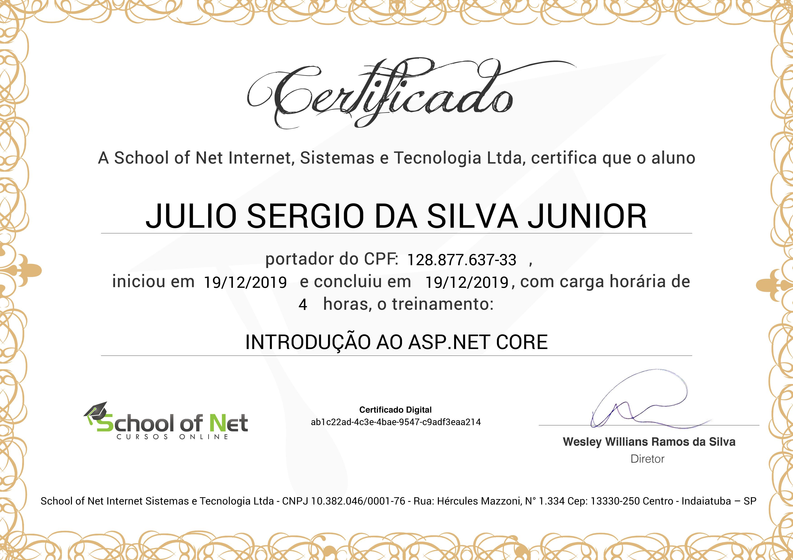

# Introdução ao ASP.NET Core
## [School of Net](https://www.schoolofnet.com)

* ASP.NET Core

Instrutor: Anybal Rocha
"O curso tem o objetivo de apresentar o ASP.NET Core 1.0, bem como suas características e uma introdução deste, trazendo um comparativo básico em relação ao ASP.NET anterior. Iremos ver os requisitos e features necessários para desenvolver uma aplicação ASP.NET Core 1.0, bem como explorar a arquitetura de uma aplicação MVC construída neste novo ASP.NET."

